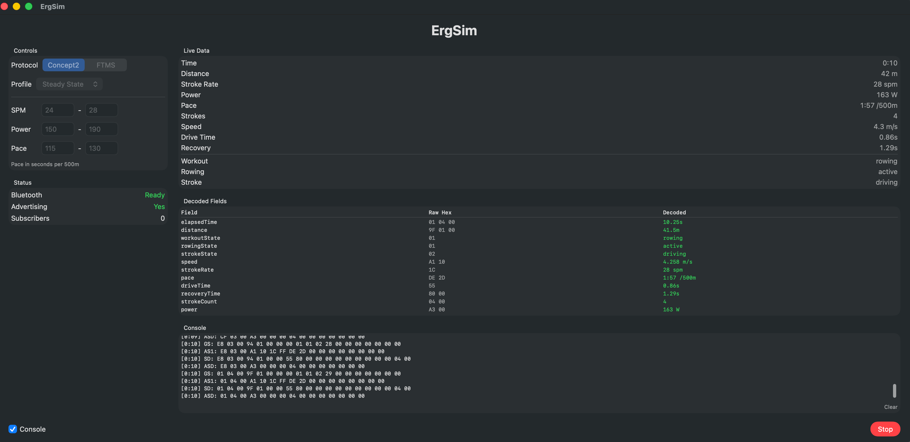

# ErgSim

A macOS BLE peripheral simulator that advertises as a rowing machine. Used to test RowUp's BLE integration without a physical erg.

## Requirements

- macOS 14+
- Bluetooth capability
- RowingKit (branch-based SPM dependency)

## Setup

1. Open `ErgSim.xcodeproj` in Xcode
2. Add RowingKit as a local or remote Swift Package dependency (both `RowingProtocols` and `RowingBLE` products)
3. Ensure Bluetooth entitlement is enabled under Signing & Capabilities > App Sandbox > Hardware
4. `NSBluetoothAlwaysUsageDescription` must be set in Info.plist

## Usage

1. Select protocol: **Concept2** or **FTMS**
2. Choose a simulation profile or set custom min/max ranges for SPM, power, and pace
3. Tap **Start** to begin advertising and publishing data
4. On iPhone, open RowUp > Debug > BLE Scanner > Scan to discover and connect

## Simulation Profiles

| Profile | SPM | Power (W) | Pace (/500m) |
|---------|-----|-----------|--------------|
| Easy Steady | 20-24 | 100-140 | 2:10-2:25 |
| Steady State | 24-28 | 150-190 | 1:55-2:10 |
| Race Pace | 30-34 | 230-280 | 1:40-1:50 |
| Sprint | 34-40 | 320-400 | 1:28-1:38 |

Selecting a profile sets the min/max ranges. Ranges can be customized manually.

## Simulation Behavior

- **Per tick (0.25s):** elapsed time increments, distance grows based on current pace
- **Per stroke:** power, SPM, and pace randomize within min/max range; stroke count increments; drive/recovery times update
- **Stroke state** cycles between driving and recovery based on timing within each stroke interval

## Console

Toggle the Console checkbox to see:

- **Decoded Fields table:** each encoded field with its raw hex bytes and decoded human-readable value
- **Scrolling log:** timestamped hex dumps per characteristic, auto-scrolling with a clear button

## Architecture

- `SimulationProfile` — min/max ranges for SPM, power, pace with preset profiles
- `SimulationEngine` — tick-based engine producing `RowingSnapshot` values
- `ContentView` — dashboard with controls, live data, and console
- `RowingPeripheral` (from RowingKit) — handles BLE advertising and characteristic updates with queue drain for multi-characteristic publish
